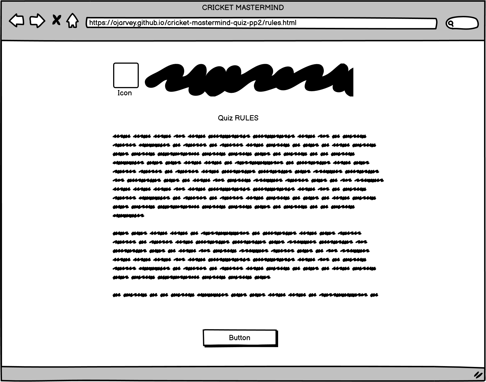

# Cricket Mastermind Quiz

Welcome to **Cricket Mastermind**, the ultimate quiz platform to test and expand your cricket knowledge! Whether you're a casual fan or a cricket aficionado, this site offers a variety of quizzes and information to challenge your understanding of the gentleman's game.

- The deployed site can be found at - [Cricket Mastermind Website](https://ojarvey.github.io/cricket-mastermind-quiz-pp2/)
- The repository can be found at - [Cricket Mastermind Github](https://github.com/OJarvey/cricket-mastermind-quiz-pp2.git)

## Table of contents

1. [First Time Visitor Goals](#first-time-visitor-goals)
2. [Features](#features)
   - [Home Page](#home-page)
   - [Random Facts Quiz](#random-facts-quiz)
   - [Guess The Player Quiz](#guess-the-player-quiz)
   - [Rules Page](#rules-page)
   - [404 Not Found Page](#404-not-found-page)
3. [Responsive Design](#responsive-design)
   - [Mobile View (Galaxy Z Fold)](#mobile-view-galaxy-z-fold)
4. [Interactivity](#interactivity)
5. [Timer and Score Tracking](#timer-and-score-tracking)
6. [Design and Validation Tools](#design-and-validation-tools)
   - [Color Palette](#color-palette)
   - [HTML and CSS Validation](#html-and-css-validation)
   - [JavaScript Validation](#javascript-validation)
   - [Performance Checks](#performance-checks)
7. [Wireframes](#wireframes)
   - [Index Page](#index-page)
   - [Facts Quiz](#facts-quiz)
   - [Guess The Player Page](#guess-the-player-page)
   - [Rules](#rules)
   - [404 Page](#404-page)
8. [Technologies Used](#technologies-used)
9. [Deployment](#deployment)
10. [Major Bugs and Fixes](#major-bugs-and-fixes)
11. [GitHub Deployment](#github-deployment)
12. [Fork Repository](#fork-repository)
13. [Clone Repository](#clone-repository)
14. [Meta Information](#meta-information)
15. [Future Enhancements](#future-enhancements)
16. [Credits](#credits)

- [Icons](#icons)
- [Font Style](#font-style)
- [Players Images and Articles](#players-images-and-articles)
- [CSS Styling](#css-styling)
- [Background Image](#background-image)
- [404 Image](#404-image)

17.[Special Thanks](#special-thanks)

### First Time Visitor Goals

- To test general quiz knowledge
- To test quiz knowledge in a selected subject
- Discover interesting trivia
- Enjoy a fun learning experience

## Features

### Home Page

The home page serves as the gateway to different sections of the website, including quizzes and rules.

- **Cricket Mastermind Logo**: Clickable logo that redirects to the home page.
- **Navigation Buttons**:
  - **Random Facts**: Learn interesting cricket facts.
  - **Guess The Player**: Identify cricketers based on their images.
  - **Rules**: Understand the rules of the cricket quiz.
  
### Random Facts Quiz

The Random Facts Quiz presents users with multiple-choice questions about cricket facts.

- **Question Section**: Presents random cricket-related questions.
- **Answer Buttons**: Four multiple-choice answers for each question.
- **Timer**: 15 seconds per question to select the correct answer.
- **Score Display**: Track your score as you progress through the quiz.
- **Play Again Option**: Option to restart the quiz or return to the home page after completing the quiz.

### Guess The Player Quiz

In the Guess the Player Quiz, users must identify cricketers based on their images.

- **Player Image**: Display an image of a cricketer to be identified.
- **Answer Buttons**: Four multiple-choice options to guess the player.
- **Timer**: 15 seconds per question to identify the player.
- **Score Display**: Track your score as you progress through the quiz.
- **Play Again Option**: Option to restart the quiz or return to the home page after completing the quiz.

### Rules Page

- **Detailed Rules**: Explanation of the rules of the cricket mastermind quiz in a well-structured format.
- **Navigation Button**: Return to the home page.

### 404 Not Found Page

- **Error Message**: Informative message indicating the requested page could not be found.
- **Home Button**: Quick access to return to the home page.

## Responsive Design

The site is designed to be fully responsive, adapting to various screen sizes and devices.

### Mobile View (Galaxy Z Fold)

The site adapts seamlessly to different screen sizes, including foldable devices like the Galaxy Z Fold.

## Interactivity

Interactive elements such as buttons provide visual feedback to the user.

## Timer and Score Tracking

The quizzes feature a countdown timer and score tracking to enhance the gaming experience.

## Design and Validation Tools

Various tools and validators were used to ensure the site is well-designed and compliant with web standards.

### Color Palette

A consistent color palette was chosen to maintain a cohesive look throughout the site.

### HTML and CSS Validation

The HTML and CSS code were validated to ensure compliance with web standards.

### JavaScript Validation

JavaScript code was checked for errors and best practices using JSHint.

### Performance Checks

Lighthouse and other performance check tools were used to ensure the site performs well on both desktop and mobile.

## Wireframes

### Index Page

#### Facts Quiz

#### Guess The Player Page

#### Rules

#### 404 Page

## Technologies Used

- **HTML**: Structure of the web pages.
- **CSS**: Styling of the web pages, including responsive design for various screen sizes.
- **JavaScript**: Interactive features such as quizzes, timers, and score tracking.
- **Google Fonts**: Custom fonts for a unique look and feel.
- **Favicon**: Custom cricket-themed icons for the website.
- **Wireframes**: Visual layout and structure designs created using [Balsamiq Wireframes]

## Deployment

- The site was deployed using GitHub Pages.
- The repository can be found at - <https://github.com/OJarvey/cricket-mastermind-quiz-pp2.git>
- The deployed site can be found at - <https://ojarvey.github.io/cricket-mastermind-quiz-pp2/>

## Major Bugs and Fixes

1. **Buttons Staying Blue After Click**
   - **Issue**: On smaller devices, the buttons stayed blue after being clicked.
   - **Solution**: Added CSS rules to prevent this behavior by setting the focus state of the buttons.

2. **Redirecting to 404 Page on Button Click**
   - **Issue**: The page kept redirecting to the 404 page whenever a button was clicked, even when the correct answer was selected.
   - **Solution**: Fixed the bug by ensuring the `checkAnswer` function was properly defined and accessible in the script.

3. **Undefined Functions Causing Errors**
   - **Issue**: `checkAnswer` and other functions were not being recognized, causing the game to crash.
   - **Solution**: Ensured all necessary functions were defined and exposed to the global scope if needed.

4. **Missing HTML Elements Causing Script Failures**
   - **Issue**: The script was failing because certain HTML elements were not found.
   - **Solution**: Added checks to ensure all elements were properly referenced.

5. **Incorrect Media Query Behavior for Buttons**
   - **Issue**: Buttons were not aligning properly on different screen sizes, and their appearance was inconsistent.
   - **Solution**: Adjusted media queries to ensure buttons are displayed correctly on various screen sizes.

### GitHub Deployment

- To deploy using GitHub pages
  - Login or Sign Up to GitHub
  - Open the project repository
  - Navigate to "Settings" on the navigation bar under the repository title
  - Click on "Pages" in the left hand navigation panel
  - Under "Source", choose which branch to deploy (Main or Master)
  - Choose which folder to deploy from, usually "/root"
  - Click "Save", then wait for the page to be deployed
  - The URL is displayed above "Source"

### Fork Repository

- To fork the reositary
  - Login or Sign Up to GitHub
  - Navigate to the repository for this project [https://github.com/OJarvey/cricket-mastermind-quiz-pp2.git]
  - Click the "Fork" button on the top right of the page

### Clone Repository

- To clone the repository
  - Login or Sign Up to GitHub
  - Naviagte to the repositary for this project [Cricket Mastermind](https://github.com/OJarvey/cricket-mastermind-quiz-pp2.git)
  - Click on the "Code" button
    - Select how you would like to clone (HTTPS, SSH, or GitHub CLI)
    - Copy your chosen link
    - Open the terminal of your code editor or IDE
    - Change the current working directory to the location you want to use for the cloned directory
    - Type "git clone" into the terminal followed by the copied link and press enter.

## Meta Information

- **Description**: "Cricket, The Gentlemen's Game."
- **Keywords**: "Cricket, sport, exercise cricket knowledge, know your cricket."

## Future Enhancements

- **More Quizzes**: Addition of more quiz types and questions.
- **Leaderboard**: Feature to compare scores with other users.
- **User Accounts**: Allow users to create accounts and track their progress.

## Credits

### Icons

- [Icons8](https://icons8.com/icons/set/cricket)

### Font Style

- [Google Fonts](https://fonts.google.com/selection/embed)

### Players Images and Articles

- Chris Gayle: [Google Image](https://encrypted-tbn1.gstatic.com/licensed-image?q=tbn:ANd9GcSFUrlOZnErvV8UfoR3M0wXyGmMasy6nmzm0XOGO4id7EyuFNT6Io6vQQjdWSfmQr_jnCLdbddZ-v5Qdpo)
- Brian Lara: [Google Image](https://encrypted-tbn1.gstatic.com/licensed-image?q=tbn:ANd9GcRU7NUUAEqIf73vQP_qAV8mSM88WALFTJk_n9EHe7xym6q-wLT6OaQRfjf1FnLSWzTeGZZEtJd9ZpNK7hQ)
- Kieron Pollard: [Khaama](https://www.khaama.com/kieron-pollard-announces-retirement-from-international-cricket-at-34/)
- Jofra Archer: [Daily Mail](https://www.dailymail.co.uk/sport/cricket/article-8613251/JOFRA-ARCHER-bowl-90mph-Ashes-spells-time-unrealistic.html)
- Andrew Flintoff: [Daily Record](https://www.dailyrecord.co.uk/sport/boxing/former-england-cricket-captain-andrew-1436001)
- Ben Stokes: [ESPN Cricinfo](https://www.espncricinfo.com/story/superlative-ben-stokes-approaches-batting-fulfilment-1213347)
- Rohit Sharma: [MensXP](https://www.mensxp.com/sports/cricket/74369-rohit-sharma-prioritises-country-over-ipl-emerges-as-the-much-needed-patriot-in-times-of-crisis.html)
- Sachin Tendulkar: [Mashable India](https://in.mashable.com/culture/73856/sachin-tendulkar-turns-51-top-15-records-achieved-by-the-god-of-cricket)
- Virat Kohli: [Britannica](https://cdn.britannica.com/48/252748-050-C514EFDB/Virat-Kohli-India-celebrates-50th-century-Cricket-November-15-2023.jpg)
- Mitchell Starc: [ESPN Cricinfo](https://www.espncricinfo.com/story/aus-vs-sa-tests-2022-mitchell-starc-wants-to-keep-those-magic-deliveries-coming-1349779)
- Bret Lee: [Al Jazeera](https://www.aljazeera.com/sports/2012/7/13/brett-lee-retires-from-international-cricket)
- Steve Smith: [GQ Australia](https://www.gq.com.au/lifestyle/success/how-one-shrewd-investment-made-steve-smith-one-of-australias-richest-ever-sportsmen/news-story/124c0a007842cf8a55c0cfcc6c6bc308)

### CSS Styling

- [LogRocket Blog](https://blog.logrocket.com/css-header-styles-cross-browser-compatibility/)

### Background Image

- [Freepik](https://www.freepik.com/free-vector/geometric-shapes-neon-lights-background_6764493.htm#query=cool%20red%20blue%20background&position=3&from_view=keyword&track=ais_user&uuid=1dac5c2f-7560-4cb2-ad2b-b6f5c4e06113)

### 404 Image

- [Herald Live](https://www.heraldlive.co.za/sport/cricket/2022-12-18-australia-bowled-out-for-218-hold-66-run-lead-against-south-africa/)

## Special Thanks

- Spencer Barriball: For his continuous encouragement and support during this period.
